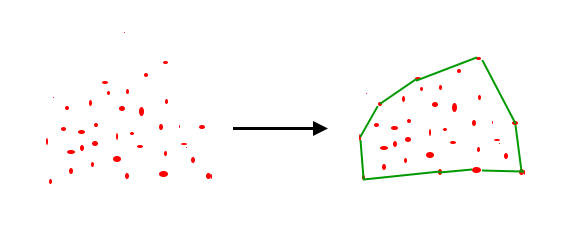

# **myConvexHull - 13520142**
> Halo! Selamat datang di repository myConvexHull!

*myConvexHull* ini dibuat oleh Rania Dwi Fadhilah - 13520142, dari K1. 

Repository berisi *myConvexHull* ini dibuat untuk memenuhi **Tugas Kecil Mata Kuliah IF2211 Strategi Algoritma** yang ke-2 pada Semester II Tahun Akademik 2021/2022. Silahkan dicoba! 



ConvexHull merupakan himpunan titik terkecil yang bentuknya mengandung seluruh himpunan S. Pada tugas kecil ini, diimplementasikan algoritma *divide and conquer* untuk menyelesaikan permasalahan ConvexHull. 

## Usage

### Dependencies
- [Python](https://www.python.org/downloads/)
- Numpy 
  ``` 
  pip install numpy 
  ```
- Pandas
  ```
  pip install pandas
  ```
- Sympy
  ```
  pip3 install sympy
  ```
- Matplotlib
  ```
  python -m pip install -U matplotlib
  ```
- Sklearn
  ```
  pip install -U scikit-learn
  ```

### Program Execution
1. Pastikan repository ini sudah ada di local repository laptop. Apabila belum, silahkan di *clone* terlebih dahulu dengan cara membuka terminal kemudian mengetik
   ```
   git clone https://github.com/raniadf/convexhull.git
   ```
2. Ubah directory anda ke root dir dari repository ini (convexhull)
3. Pada terminal, ketik
   ```
   python src/main.py
   ```
4. Pilih dataset yang ingin diakses (apabila ingin menggunakan file csv, pastikan bahwa file memiliki kolom target karena program tidak dapat mengolah data tanpa target)
5. Pilih kolom acuan untuk X dan Y
6. Program akan berjalan!